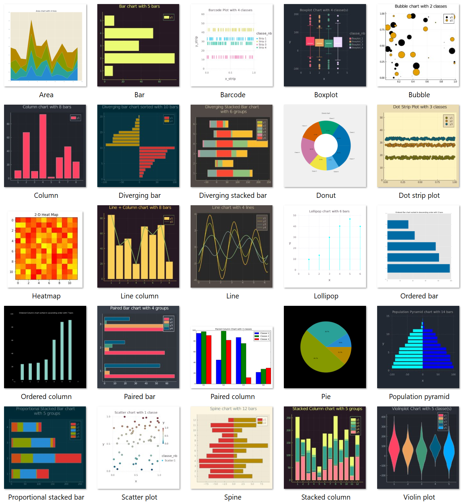
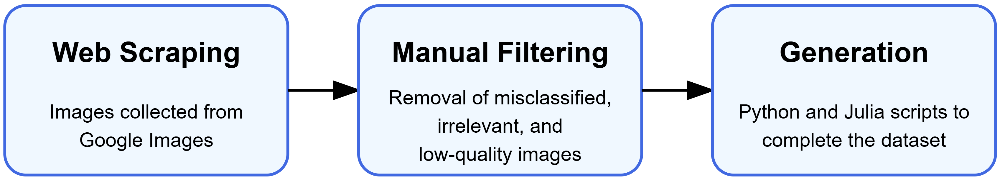
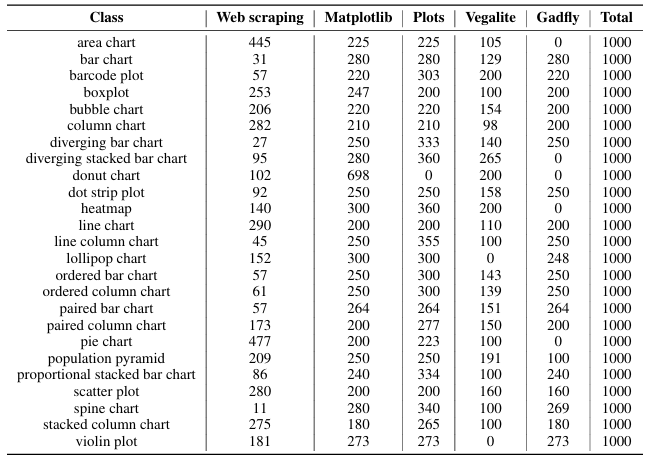

# CNNvsVLMforChartImageClassification

[](https://creativecommons.org/licenses/by-nc-sa/4.0/)

This repository contains the code and resources for the research paper: **"A Comparative Study of CNNs and Vision-Language Models for Chart Image Classification"** published at [SCITEPRESS, 2025](https://www.scitepress.org/publishedPapers/2025/133745/pdf/index.html).

## Overview

This project compares the performance of Convolutional Neural Networks (CNNs) and Vision-Language Models (VLMs) for classifying chart images across 25 different chart types commonly used in business and data visualization contexts.

<p align="center">
  
  <br>
  <em>Examples of the 25 chart types in our dataset</em>
</p>

## Repository Structure

```
CNNvsVLMforChartImageClassification/
├── assets/
│   └── dataset_composition.png                  # Visualization of the dataset composition
├── ChartClassification_with_CNNs/               # CNN-based classification
│   ├── dtnls_models/                            # Implementation of AlexNet model
│   ├── saved_models/                            # Saved trained models and results
│   ├── cnns_training.py                         # Script for training CNN models
│   ├── main.py                                  # Main script for CNN experiments
│   ├── plot_confusion_matrix.py                 # Utility for plotting confusion matrices
│   └── README.md                                # Documentation for CNN experiments
├── ChartClassification_with_VLMs/               # VLM-based classification
│   ├── ChartClassification_with_ChartLlama-13b/ # ChartLlama VLM evaluation
│   ├── ChartClassification_with_LLaVA/          # LLaVA family VLMs evaluation
│   ├── ChartClassification_with_paligemma-3b-ft-vqav2-448/ # Paligemma VLM evaluation
│   └── ChartClassification_with_TinyChart-3B-768/ # TinyChart evaluation
├── Image_Dataset/                               # Dataset preparation
│   ├── chartClasses/                            # Chart images organized by class
│   │   ├── test/                                # Test set images
│   │   ├── train/                               # Training set images
│   │   └── validation/                          # Validation set images
│   ├── create_save_supervised_data.py           # Script for dataset preparation
│   └── README.md                                # Dataset documentation
└── selenium_crawler/                            # Web scraping tools
    ├── chartClasses/                            # Scraped chart images
    ├── seleniumCrawler.py                       # Google image scraping script
    └── README.md                                # Documentation for web scraping
```

## Dataset

Our dataset consists of 25,000 chart images divided into 25 classes (1,000 images per class). The chart types were selected to reflect those commonly used in professional data visualization software.

### Dataset Construction Process

We created the dataset through a three-step process:

<p align="center">
  
  <br>
  <em>Three-step process for dataset creation</em>
</p>

1. **Web Scraping**: Images were collected from Google Images using Selenium automation (see `selenium_crawler` directory)
2. **Manual Filtering**: The scraped images were manually filtered to remove misclassified, irrelevant, or low-quality images
3. **Automated Generation**: Additional chart images were generated using graphics libraries in Python (Matplotlib) and Julia (Plots, Vegalite, and Gadfly) to reach 1,000 images per class

### Dataset Composition

The composition of our dataset, showing the exact breakdown of image sources (web scraping and various generation libraries) for each chart type, is visualized in the image below:

<p align="center">
  
  <br>
  <em>Detailed composition of the 25 chart types in our dataset</em>
</p>

As shown in the figure, each chart class contains a total of 1,000 images from various sources. Some chart types have more web-scraped images (e.g., area chart, pie chart), while others rely more heavily on generated images due to the limited availability of high-quality samples on the web.

### Dataset Organization

The final dataset is organized as follows:

```
Image_Dataset/chartClasses/
├── test/             # 20% of images
│   ├── area/
│   ├── bar/
│   ├── ...
├── train/            # 70% of images
│   ├── area/
│   ├── bar/
│   ├── ...
└── validation/       # 10% of images
    ├── area/
    ├── bar/
    └── ...
```

### Data Preparation for Models

The script `Image_Dataset/create_save_supervised_data.py` processes the images (resizing to 400x400 pixels), converts them to arrays, and saves them as compressed NumPy files ready for model training and evaluation.

### Accessing the Dataset

To prepare the dataset, follow these steps:

1. **Web Scraping**:
   ```bash
   cd selenium_crawler
   python seleniumCrawler.py
   ```

2. **Manual Filtering**:
   - Review and clean the scraped images
   - Organize them into the appropriate folders in `Image_Dataset/chartClasses/`

3. **Data Preparation**:
   ```bash
   cd Image_Dataset
   python create_save_supervised_data.py
   ```

For more details on dataset creation, see the README files in the `selenium_crawler` and `Image_Dataset` directories.

## CNN Models

We evaluated six different CNN architectures for chart image classification:

1. **AlexNet**: The pioneering deep CNN architecture (2012), consisting of five convolutional layers followed by three fully connected layers, establishing fundamental principles for modern deep learning.

2. **VGG16**: Features a deeper architecture with 16 layers (2014) using small 3×3 convolution filters throughout the network, emphasizing the benefits of network depth with uniform structure.

3. **Inception-v3**: Employs parallel convolution paths of varying scales (2015) within its Inception modules, enabling multi-scale feature processing through its unique module design.

4. **Inception-ResNet-v2**: Combines the Inception modules with residual connections (2016), enhancing gradient flow and feature extraction capabilities through this hybrid architecture.

5. **Xception**: Leverages depthwise separable convolutions (2017) to efficiently process cross-channel and spatial correlations, representing an extreme version of the Inception hypothesis.

6. **EfficientNetB4**: A scaled version of the EfficientNet architecture (2019) optimized through neural architecture search, offering state-of-the-art performance with fewer parameters through balanced scaling of network depth, width, and resolution.

The CNN models were trained using two approaches:
- **Full training**: Training the models from scratch with random initialization
- **Fine-tuning**: Leveraging pre-trained weights from ImageNet and fine-tuning for chart classification

The implementation and training scripts for these models are available in the `ChartClassification_with_CNNs` directory.

## Vision-Language Models

We also evaluated several Vision-Language Models (VLMs) using zero-shot prompting to assess their ability to classify chart images without specific training on this task. The VLMs include both general-purpose models and chart-specific models.

For details on the VLM evaluations, see the README in the `ChartClassification_with_VLMs` directory.

## Implementation Details

All experiments were conducted on an Azure **NC24ads A100 v4** instance equipped with:
- 24-core CPU
- 220 GB of RAM
- NVIDIA A100 graphics card (80 GB memory)

## Usage

Each subdirectory contains detailed instructions on how to use the respective components:

- For CNN training and evaluation, see `ChartClassification_with_CNNs/README.md`
- For VLM evaluation, see `ChartClassification_with_VLMs/README.md`
- For dataset preparation, see `Image_Dataset/README.md`

## License

This project is licensed under the Creative Commons Attribution-NonCommercial-ShareAlike 4.0 International License (CC BY-NC-SA 4.0). For the full license text, visit: [https://creativecommons.org/licenses/by-nc-sa/4.0/](https://creativecommons.org/licenses/by-nc-sa/4.0/).

This license applies to the evaluation code and dataset preparation tools developed for this research. It allows for:
- Sharing and adapting the material with appropriate credit
- Non-commercial use only
- Distribution of derivative works under the same license

However, please note that the Vision-Language Models (VLMs) evaluated in this research are subject to their own respective licenses:
- ChartLlama, LLaVA, and TinyChart models are subject to their respective licenses
- PaLI-GEMMA is made available under Google's model license

When using our evaluation code with any of these models, you must comply with both our CC BY-NC-SA 4.0 license AND the respective model licenses.

This code is intended for research and educational purposes only.

## Citation

If you use this code or dataset in your research, please cite our paper:

```bibtex
@inproceedings{come2025comparative,
  title={A Comparative Study of CNNs and Vision-Language Models for Chart Image Classification},
  author={Côme, Bruno and Devanne, Maxime and Weber, Jonathan and Forestier, Germain},
  booktitle={Proceedings of the XXth International Conference on Computer Vision Theory and Applications},
  year={2025},
  publisher={SCITEPRESS}
}
```
